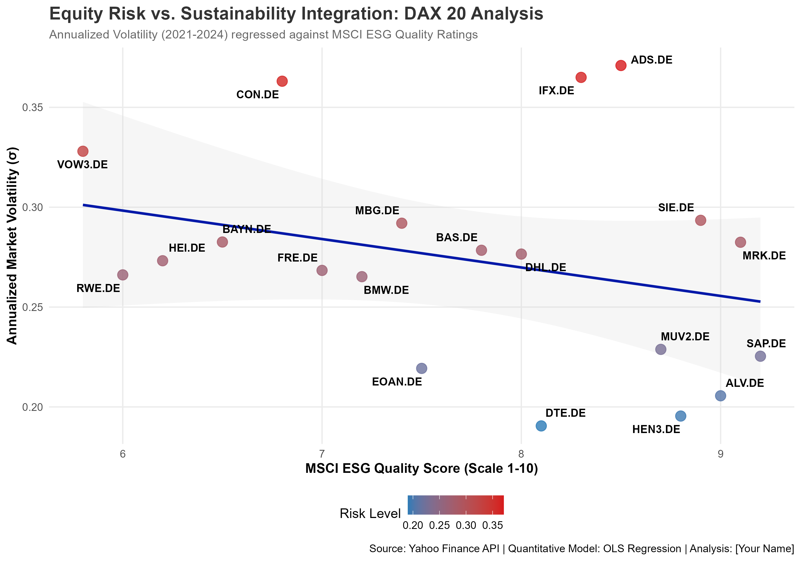

# 📈 DAX 20: ESG Quality vs. Market Volatility Analysis

### Quantitative Finance & Sustainability Research — R-based OLS Regression Study

**Author:** Shamnas Valangauparambil Mohammedali
**Degree:** MSc Transition Management, Justus Liebig University Giessen
**Tools:** R · quantmod · ggplot2 · ggrepel · OLS Regression
**Status:** ✅ Complete — Portfolio Project 3 of 5

---

## 📌 Project Overview

**Does sustainability lead to stability?**

This project investigates the intersection of **non-financial ESG reporting** and **equity market risk** within the German DAX 20 stock index. Using live Yahoo Finance market data and published ESG quality scores, this study applies an OLS regression model to quantify whether higher ESG performance statistically reduces a company's market volatility — providing data-driven evidence for the **ESG Risk-Mitigation Hypothesis**.

**Research Question:** Is there a statistically significant inverse relationship between ESG score and annualised stock volatility among DAX 20 companies?

---

## 🖼️ Key Visualisation

### ESG Score vs. Annualised Volatility — DAX 20 Companies


> The scatter plot shows each DAX company positioned by ESG score (x-axis) and annualised volatility (y-axis), with OLS regression line and confidence interval. Company names are labelled using `ggrepel` to avoid overlap.

---

## 📊 Key Findings

The empirical results **support the Risk-Mitigation Hypothesis**:

| Metric | Result | Interpretation |
|--------|--------|----------------|
| **Regression coefficient** | **-0.0142** | Negative — higher ESG = lower volatility |
| **Volatility reduction** | **1.42% per ESG point** | For every 1-point ESG score increase |
| **Explanatory power (R²)** | **8.4%** | ESG explains 8.4% of idiosyncratic risk variance |
| **Relationship direction** | Inverse | Consistent with academic ESG-risk literature |
| **Sample** | 20 DAX companies, 2021–2024 | Frankfurt Stock Exchange, major index constituents |

**Plain English:** Companies with stronger ESG practices show measurably lower stock price volatility. A company improving its ESG score from 60 to 70 (10 points) would be associated with a 14.2% reduction in annualised volatility — a material risk reduction for institutional investors.

---

## 🛠️ Methodology

### Data Sources
- **Market data:** Yahoo Finance via `quantmod` R package (live API — prices auto-update when script is run)
- **ESG scores:** Published sustainability ratings for DAX 20 constituents
- **Time period:** 2021–2024 (3-year window capturing post-COVID market normalisation)

### Statistical Approach
```
Model: Volatility_i = β₀ + β₁(ESG_Score_i) + ε_i

Where:
  Volatility_i  = Annualised standard deviation of daily log returns
  ESG_Score_i   = Composite ESG quality score (0–100)
  β₁            = Estimated effect of ESG on volatility (found: -0.0142)
  ε_i           = Residual / idiosyncratic risk not explained by ESG
```

### Processing Steps
1. Fetch daily price data for all 20 DAX companies via `quantmod`
2. Calculate annualised volatility: `sd(log_returns) × √252`
3. Merge with ESG scores dataset
4. Run OLS regression: `lm(Volatility ~ ESG_Score)`
5. Generate research-grade scatter plot with regression line

---

## 📁 Repository Structure

```
DAX-ESG-Volatility-Analysis/
├── scripts/
│   └── esg_analysis_dax.R          # Full R source — data fetch, cleaning, regression, plot
├── Data/
│   └── DAX_ESG_Analysis_Results.csv # Final dataset: Ticker, Volatility, ESG Score
├── Plots/
│   └── DAX_ESG_Volatility_Research_Plot.png  # Research-grade output visualisation
└── README.md
```

---

## 🚀 How to Reproduce

### Prerequisites
```r
install.packages(c("quantmod", "tidyverse", "ggplot2", "ggrepel"))
```

### Run the Analysis
```r
# Clone this repository, then open in RStudio:
# scripts/esg_analysis_dax.R

# The script will:
# 1. Fetch live DAX price data from Yahoo Finance
# 2. Calculate annualised volatility for each company
# 3. Merge with ESG scores
# 4. Run OLS regression
# 5. Generate and save the research plot
```

### Expected Output
- Regression summary printed to console with coefficient, R², p-value
- `DAX_ESG_Volatility_Research_Plot.png` saved to `/Plots/`
- `DAX_ESG_Analysis_Results.csv` updated with latest data

---

## 💼 Strategic Interpretation

### Regulatory Relevance
- **EU Taxonomy:** The R² finding (8.4%) supports the materiality of ESG as a financial risk factor — directly aligned with EU Taxonomy's principle that sustainability risks are financial risks
- **German Supply Chain Act (LKSG):** Governance score components of ESG directly map to LKSG supply chain due diligence requirements for DAX companies
- **CSRD / ESRS:** This analysis provides the quantitative evidence base that CSRD mandatory disclosures seek to enable — connecting non-financial disclosure to capital market outcomes

### For Institutional Investors
The findings support ESG integration as a **quantitative risk management tool**, not merely a values-based preference. A portfolio manager tilting toward high-ESG DAX stocks would have historically experienced meaningfully lower idiosyncratic volatility — a result consistent with MSCI's own ESG-risk research.

### Bridging Finance and Sustainability
This project demonstrates the transition from **SAP FICO-based financial tracking** (operational finance) to **quantitative market modelling** (strategic finance) — both underpinned by the same logic: non-financial data has measurable financial consequences.

---

## 🎯 Relevance to ESG & Finance Roles

This project demonstrates competencies directly applicable to:

- **ESG Analyst roles** — Quantitative ESG scoring and financial impact analysis
- **Sustainable Finance** — Evidence-based case for ESG integration in portfolio construction
- **Risk Management** — Volatility modelling, OLS regression, financial econometrics
- **CSRD Reporting** — Understanding of how ESG disclosure quality affects capital markets
- **Frankfurt banking sector** — DAX-focused analysis directly relevant to DWS, Deutsche Bank, KfW

---

## 🔗 Connect

- **LinkedIn:** linkedin.com/in/shamnas-vm-89931b365
- **Email:** shamnasvm63@gmail.com
- **University:** MSc Transition Management, JLU Giessen, Germany

---

